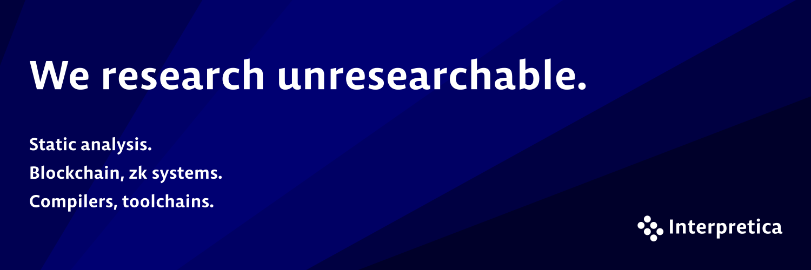

# Interpretica is a research-driven engineering team working on foundational software technologies.

We specialize in:

- Static analysis
- Blockchain and zk systems
- Compilers and toolchains

Our goal is to turn complex theoretical ideas into practical, production-grade tooling and infrastructure.
We also apply AI where it genuinely improves results - as an instrument, not a trend, and always grounded in solid engineering.

## Open-source.

We are publishing all projects that we may share. That's our commitment to the open-source community.

Stay tuned for updates!

## Projects & organizations

Our fleet of organizations:
 - [Isabelle Platform](https://github.com/isabelle-platform)
 - [Intranet Platform](https://github.com/intranet-platform)
 - [DefectDB](https://github.com/defectdb)

Minor projects:
 - [fmtparser](https://github.com/fmtparser)
